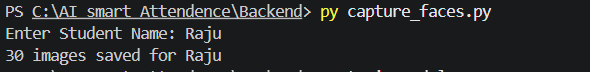
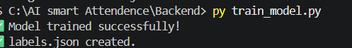

# 🤖 AI Smart Attendance Management System

An AI-powered Attendance Management System that automatically detects and recognizes student faces using Computer Vision and Machine Learning. The system captures student face images, trains a face recognition model using the **LBPH (Local Binary Pattern Histogram)** algorithm, and marks attendance automatically in a local SQLite database.

---

## 📌 Features

- 📸 Capture student face images using a webcam
- 👤 Face Detection using Haar Cascade Classifier
- 🧠 Face Recognition using LBPH Face Recognizer
- 🏷️ Automatic student label generation
- ✅ Automatic attendance marking
- ⏰ Automatic date and time recording
- 🚫 Prevents duplicate attendance during the same session
- 🎥 Real-time face recognition

---

# 🛠️ Tech Stack

## Programming Language

- Python 3.11+

## Libraries

- OpenCV
- OpenCV-Contrib
- NumPy


---

# 📂 Project Structure

```text
Backend/
│
├── dataset/                 # Student face dataset
├── attendance.db            # SQLite attendance database
├── capture_faces.py         # Capture student face images
├── database.py              # Database creation and management
├── face_detection.py        # Face detection using Haar Cascade
├── labels.json              # Student label mapping
├── recognize.py             # Real-time face recognition
├── test_camera.py           # Camera testing script
├── train_model.py           # Train the LBPH face recognizer
├── trainer.yml              # Trained face recognition model
└── README.md                # Project documentation
```

---

# ⚙️ Installation

## 1. Clone the Repository

```bash
git clone https://github.com/nityansh6674/AI-Smart-Attendance-System.git
```

## 2. Open the Project Folder

```bash
cd AI-Smart-Attendance-System
```

## 3. Create Virtual Environment

```bash
python -m venv venv
```

## 4. Activate Virtual Environment

### Windows

```bash
venv\Scripts\activate
```

### Linux / macOS

```bash
source venv/bin/activate
```

## 5. Install Required Packages

```bash
pip install opencv-python
pip install opencv-contrib-python
pip install numpy
```

Or install using

```bash
pip install -r requirements.txt
```

---

# 🚀 Project Workflow

### Step 1 — Create Database

```bash
database.py
```

Creates the SQLite database for storing attendance records.

---

### Step 2 — Capture Student Face Images

```bash
python capture_faces.py
```

- Enter the student's name.
- Captures 30 face images.
- Saves the images inside the `dataset` folder.

---

### Step 3 — Train the Face Recognition Model

```bash
python train_model.py
```

This generates:

- `trainer.yml`
- `labels.json`

---

### Step 4 — Start Face Recognition

```bash
python recognize.py
```

The system will:

- Detect student faces
- Recognize registered students
- Mark attendance automatically
- Save attendance with current date and time

---

# 🧠 AI Model

This project uses two Computer Vision techniques:

### Face Detection

- Haar Cascade Classifier

### Face Recognition

- LBPH (Local Binary Pattern Histogram) Face Recognizer

LBPH is lightweight, fast, and performs well for small and medium-sized face datasets.

---

# 🗄️ Database Schema

| Column | Type |
|----------|----------|
| id | INTEGER |
| student_name | TEXT |
| date | TEXT |
| time | TEXT |

---

# 📦 Required Packages

```text
opencv-python
opencv-contrib-python
numpy
```

Generate `requirements.txt`

```bash
pip freeze > requirements.txt
```

---
# 📷 Project Screenshots

## 📸 Face Capture

The system captures 30 facial images of the student using the webcam to create the training dataset.



---

## 🧠 Model Training

The captured images are processed to train the **LBPH Face Recognizer**, generating the trained model (`trainer.yml`) and label mappings (`labels.json`).



---

## 👤 Face Recognition

The trained model is loaded successfully, enabling real-time face detection and recognition.


---

# 🎯 Applications

- Schools
- Colleges
- Universities
- Coaching Institutes
- Offices
- Employee Attendance Systems

---


# 👨‍💻 Author

**Nityansh Maurya**

Computer Science Engineering Student

---

# 📄 License

This project is developed for educational purposes and academic learning.

---

# ⭐ Support

If you found this project useful, consider giving it a ⭐ on GitHub.
